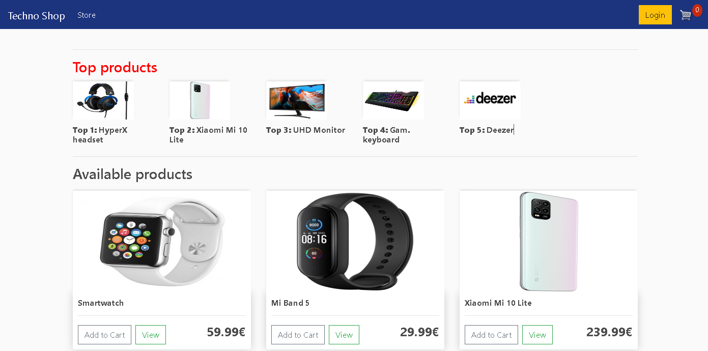
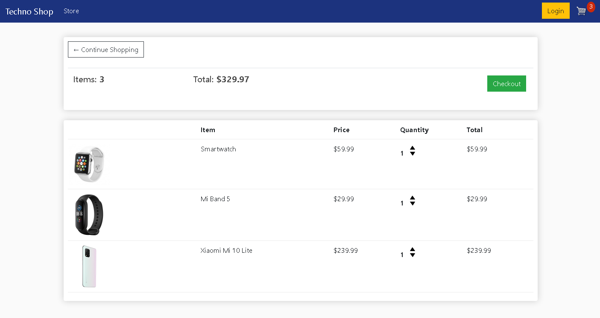
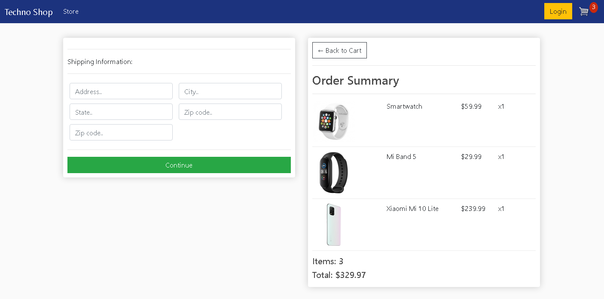

# Django e-commerce website

This is a simple e-commerce website built with Django. 
## Gallery 
### Product view

### Cart view

### Checkout view


# How to use? 
You should start by having Python installed on your computer. 

- Download or clone de repository
- Install Redis (you can install it [here](https://redis.io/download).)

- Install the project dependencies with :
    ```
    pip install requirements.txt
    ```
- Now you can run the project with this command:
    ```
    python manage.py runserver
    ```

# Description

The website displays products. Users can add and remove products to/from their cart while also specifying the quantity of each item. They can then enter their address and process the order. 

## Features
### Implemented 
    - Add/remove quantity products from cart 
    - Logged user checkout
    - Guest checkout 
    - Special checkout for digital products
    - Product ranking by Top ordered products
## To implement
    - Product view
    - Payments processing 
    - Product ranking by Top viewed products
    
## Project contribution
If you want to contribute to the project by adding new features listed above, you are welcome :) 
## Sources 
Project based on Dennis Ivy's [tutorial](https://www.youtube.com/channel/UCTZRcDjjkVajGL6wd76UnGg).
